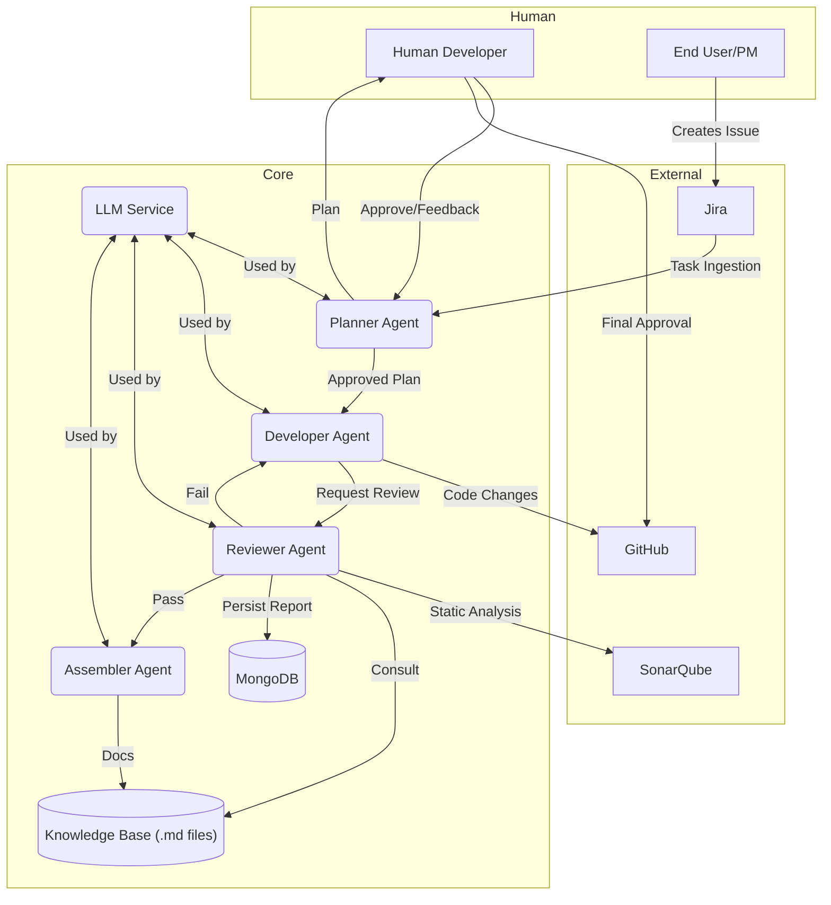

# Aristotle-I: System Design Document

**Author:** Debabrata Das  
**Last Updated:** 2025-10-25  
**Status:** Active  
**Version:** 1.0  
**Document Location:** `DESIGN.md`

---

## Revision History

| Date | Version | Author | Changes |
|------|---------|--------|---------|
| 2025-10-25 | 1.0 | Debabrata Das | Enhanced architecture, detailed components, deployment strategies |
| 2025-10-24 | 0.9 | Debabrata Das | Initial comprehensive design with security and operational details |

## Executive Summary

**Aristotle-I** is a multi-agent, Human-in-the-Loop (HITL) autonomous software engineering platform designed to accelerate the software development lifecycle while maintaining human oversight and control. The system orchestrates specialized AI agents that work collaboratively to automate planning, code generation, quality assurance, and documentation across the entire SDLC.

### Key Capabilities
- **Intelligent Task Decomposition**: Uses Graph of Thought (GOT) methodology to break down complex requirements
- **Autonomous Code Generation**: AI-driven development with iterative feedback loops
- **Comprehensive Code Review**: Multi-dimensional analysis covering completeness, security, and standards
- **Seamless Integrations**: Direct coupling with Jira, GitHub, and SonarQube
- **Human Oversight**: Strategic HITL checkpoints ensure human agency at critical decision points
- **Production-Ready**: Enterprise features including audit trails, role-based access, and disaster recovery

### Target Users
- Development teams looking to accelerate routine tasks
- Organizations seeking consistent code quality and standards
- Teams with high-volume feature requests or maintenance backlogs

## Goals
- Automate repetitive SDLC tasks while preserving human control.
- Increase developer productivity and consistency.
- Improve code quality using automated reviews and policy enforcement.
- Produce standardized, traceable documentation for audited changes.

## Non\-Goals
- Replace human architects or project managers.
- Provision cloud infrastructure, run CI/CD pipelines, or perform deployments.
- Fully autonomous, unsupervised production commits.

## Terminology
- Agent: A software component that performs a discrete responsibility (Planner, Developer, Reviewer, Assembler).
- HITL: Human\-in\-the\-Loop — explicit points where a human reviews and approves.
- LLM Service: Abstraction endpoint that routes prompts to one or more LLM providers.
- MAX_REBUILD_ATTEMPTS: System threshold to escalate human attention when automated loops fail.

## Use Cases

### 1. **Rapid Feature Development**
A new Jira issue describing a feature request flows through the system:
- **Planner Agent** analyzes the ticket and creates a detailed execution plan
- Human developer reviews and approves the plan via UI
- **Developer Agent** generates code, unit tests, and documentation
- **Reviewer Agent** performs automated quality checks
- Upon approval, the code is pushed to GitHub as a PR for final human review

### 2. **Legacy Code Enhancement**
An existing pull request needs augmentation:
- **Developer Agent** enhances the code with additional features or refactoring
- **Reviewer Agent** analyzes changes against established patterns and standards
- **Assembler Agent** generates updated documentation
- Changes are tracked in the Knowledge Base for future reference

### 3. **Codebase Refactoring & Standardization**
A large-scale refactor is needed across the codebase:
- System suggests refactoring plan with estimates and impact analysis
- Human project manager approves the scope
- System executes staged refactoring with continuous quality checks
- Each phase can be reviewed and rolled back if needed

### 4. **Security & Compliance Audit**
Regular security and compliance checks across repositories:
- **Reviewer Agent** performs security analysis using SonarQube
- Identifies vulnerabilities and compliance violations
- **Developer Agent** generates patches for common issues
- Audit trail is maintained for regulatory compliance

## Architecture Overview



## Component Breakdown

### Core Agents

#### **Planner Agent**
**Responsibility**: Strategic task decomposition and execution planning

- **Input**: JIRA issue with requirements and acceptance criteria
- **Output**: Structured execution plan with subtasks, dependencies, and effort estimates
- **Process**:
  1. Ingests issue description and context
  2. Decides between Chain-of-Thought (CoT) for simple tasks or Graph-of-Thought (GOT) for complex tasks
  3. Decomposes into scored, sequenced subtasks
  4. Merges related subtasks for optimal execution
  5. Generates human-readable plan artifact
- **HITL Checkpoints**: 
  - Plan review and approval before execution
  - Feedback incorporation if human rejects plan
- **Scoring Threshold**: 7.0 (scale 0-10)

#### **Developer Agent**
**Responsibility**: Code generation, testing, and implementation

- **Input**: Approved plan, codebase context, and requirements
- **Output**: Code changes, unit tests, and changelog entries
- **Process**:
  1. Analyzes plan and existing codebase
  2. Generates or modifies code files
  3. Creates comprehensive unit tests
  4. Documents changes in changelog
  5. Prepares commit message and branch name
- **Quality Gates**:
  - Unit test pass rate > 95%
  - Code coverage > 70%
  - Linting compliance 100%
- **Retry Logic**: Up to 3 rebuild attempts if review fails

#### **Reviewer Agent**
**Responsibility**: Multi-dimensional code quality assessment

- **Input**: Code changes, test results, and standards documentation
- **Output**: Comprehensive review report with scoring and remediation suggestions
- **Analysis Dimensions**:
  - **Completeness**: Requirement coverage and implementation thoroughness
  - **Security**: Vulnerability detection, injection points, authentication/authorization
  - **Coding Standards**: Language-specific patterns, naming conventions, best practices
  - **Performance**: Algorithm efficiency, resource usage, scalability concerns
- **Signals**:
  - LLM-based semantic analysis
  - SonarQube integration for static analysis
  - Pattern matching against Knowledge Base standards
- **Approval Criteria**: Overall score ≥ 7.5/10 with no critical issues

#### **Assembler Agent**
**Responsibility**: Documentation and deployment artifact generation

- **Input**: Code, changes, and execution metadata
- **Output**: Markdown documentation, deployment guides, and audit logs
- **Artifacts Generated**:
  - Technical design documentation
  - API documentation (if applicable)
  - Deployment and rollback procedures
  - Change summary for release notes
  - Audit trail for compliance

### Supporting Services

#### **LLM Service**
Provider-agnostic abstraction for language model interactions

- **Features**:
  - Multi-provider support (OpenAI, OpenRouter, local models)
  - Per-agent model configuration
  - Automatic fallback to alternative providers
  - Request throttling and rate limiting
  - Cost tracking and optimization
  - Response sanitization and validation
- **Response Repair**: Automatic JSON repair for malformed responses

#### **Database Service (MongoDB)**
Persistent storage for workflow state and artifacts

- **Collections**:
  - `tasks`: JIRA issue mappings and task state
  - `plans`: Generated execution plans with scoring
  - `changesets`: Code changes and diffs
  - `reviews`: Review reports and quality metrics
  - `audit_logs`: Immutable action history
  - `metrics`: Performance and usage statistics
- **Indexing**: Optimized queries for active task tracking
- **Retention**: Configurable archival policy

#### **Knowledge Base**
Markdown-based standards and pattern repository

- **Contents**:
  - Coding standards per language
  - Security guidelines and patterns
  - Company-specific conventions
  - Prompt templates with version history
  - Approved architectural patterns
- **Storage**: Git-tracked for version control and audit

### Integration Components

#### **JIRA Connector**
- Webhook-based issue ingestion
- Issue state synchronization
- Automatic transition on workflow completion
- Comment updates with execution status

#### **GitHub Connector**
- Branch creation and management
- Commit and PR creation
- Automatic PR linking to JIRA
- Status checks and required reviews

#### **SonarQube Connector**
- Project analysis and report retrieval
- Vulnerability and hotspot detection
- Code coverage metrics
- Quality gate enforcement

### User Interface

#### **React UI Dashboard**
Modern web-based system monitoring and control

- **Views**:
  - Active tasks dashboard with real-time status
  - Plan review interface with diff viewer
  - Code review details with issue highlights
  - Performance metrics and analytics
  - System configuration and settings
- **Features**:
  - Real-time WebSocket updates
  - One-click approval/rejection
  - Detailed execution logs
  - Cost tracking dashboard
  - Audit trail viewer

## Data Model

### Core Collections

#### **Task**
```
{
  _id: ObjectId,
  jira_id: String,
  jira_key: String,
  status: "pending" | "planning" | "approved" | "developing" | "reviewing" | "completed" | "failed",
  created_at: Timestamp,
  created_by: String (username/email),
  assigned_agent: String,
  plan_id: ObjectId (ref: Plan),
  changeset_ids: [ObjectId] (ref: ChangeSet),
  metadata: {
    priority: "low" | "medium" | "high" | "critical",
    complexity: Number (0-10),
    estimated_hours: Number
  }
}
```

#### **Plan**
```
{
  _id: ObjectId,
  task_id: ObjectId (ref: Task),
  steps: [
    {
      id: Number,
      description: String,
      dependencies: [Number],
      estimated_time_minutes: Number,
      priority: Number (1-10)
    }
  ],
  overall_score: Number (0-10),
  approvals: [
    {
      user: String,
      timestamp: Timestamp,
      approved: Boolean,
      feedback: String
    }
  ],
  created_at: Timestamp,
  generated_by: String
}
```

#### **ChangeSet**
```
{
  _id: ObjectId,
  task_id: ObjectId (ref: Task),
  files_changed: [
    {
      path: String,
      action: "create" | "modify" | "delete",
      language: String,
      additions: Number,
      deletions: Number
    }
  ],
  diff: String (unified diff format),
  tests_added: [
    {
      file_path: String,
      test_count: Number,
      pass_count: Number
    }
  ],
  commit_message: String,
  branch_name: String,
  pr_url: String,
  created_at: Timestamp,
  created_by: String
}
```

#### **ReviewReport**
```
{
  _id: ObjectId,
  changeset_id: ObjectId (ref: ChangeSet),
  overall_score: Number (0-100),
  threshold: Number (70),
  approved: Boolean,
  dimensions: {
    completeness: {
      score: Number,
      issues: [String],
      coverage_percent: Number
    },
    security: {
      score: Number,
      vulnerabilities: [String],
      severity_levels: [String]
    },
    coding_standards: {
      score: Number,
      violations: [String],
      language: String
    }
  },
  sonar_summary: {
    bugs: Number,
    vulnerabilities: Number,
    code_smells: Number,
    coverage_percent: Number
  },
  created_at: Timestamp,
  created_by: String (agent name),
  review_cycles: Number
}
```

#### **AuditLog**
```
{
  _id: ObjectId,
  timestamp: Timestamp,
  event_type: String (e.g., "plan_created", "code_approved", "system_error"),
  actor: String (user or system component),
  task_id: ObjectId,
  resource_id: ObjectId,
  changes: {
    before: Any,
    after: Any
  },
  metadata: Object
}
```

## Interfaces & APIs
- Jira Connector: Ingests webhooks; maps issue fields to Task model.
- GitHub Connector: Create branches, PRs, comments; minimal PAT scope (repo:status, repo:pull).
- SonarQube Connector: Fetch static analysis results; influence Reviewer scoring.
- LLM Service API: Prompt templates, request throttling, provider fallback.

API contract examples (conceptual):
- POST /api/v1/tasks — create task (from Jira)
- GET /api/v1/tasks/{id}/plan — retrieve generated plan
- POST /api/v1/tasks/{id}/plan/approve — human approval
- POST /api/v1/changesets/{id}/approve — final approval / push

## Security & Compliance

### Authentication & Authorization
- **API Security**:
  - All external API calls use TLS 1.2+
  - API keys stored in secrets manager (Vault, AWS Secrets Manager)
  - Never commit secrets to version control
  - Automatic secret rotation enabled
  
- **RBAC**:
  - Admin: Full system access, configuration, user management
  - Reviewer: Can approve/reject plans and code reviews
  - Developer: View-only access to tasks and metrics
  - Service Account: Limited API access for integrations

### Data Protection
- **Secrets Management**:
  - GitHub PAT: Scoped to minimum required permissions (repo:status, pull_request)
  - JIRA Token: Service account with project-level permissions only
  - LLM API Keys: Rotated regularly, monitored for unusual usage patterns
  
- **PII Handling**:
  - Automatic detection and redaction of personally identifiable information
  - Redaction in logs, LLM prompts, and stored artifacts
  - Compliance with GDPR, CCPA, and other privacy regulations
  - Data retention policies configurable by organization

### Input Validation & Sanitization
- **External Input Sources** (JIRA, PR descriptions, user uploads):
  - Validate input type and schema
  - Sanitize HTML/script tags
  - Apply prompt injection mitigation
  - Size limits enforced (max 50KB per field)
  
- **LLM Prompt Safety**:
  - Template-based prompts with strict placeholders
  - No direct string interpolation of user input
  - Response validation and type checking
  - Automatic prompt repair for malformed responses

### Audit & Compliance
- **Immutable Audit Logs**:
  - All significant actions logged to MongoDB with timestamps
  - Actor identification (user email or service name)
  - Change tracking with before/after snapshots
  - Export to SIEM for centralized monitoring
  
- **Compliance Features**:
  - Audit trail for regulatory investigations
  - Retention policies: 90 days for hot storage, 2 years archived
  - Compliance reports generated on demand
  - Integration with compliance frameworks (SOC 2, ISO 27001)

### Error Handling & Monitoring
- **Secure Error Reporting**:
  - No sensitive data in error messages
  - Stack traces only in debug mode
  - Structured logging with sensitive field masking
  - Alert on suspicious patterns
  
- **Monitoring & Alerting**:
  - Failed authentication attempts logged
  - API rate limiting exceeded alerts
  - Unusual LLM usage patterns detected
  - Cost anomalies flagged for review

## Reliability, Resilience & Scalability

### High Availability
- **Stateless Design**:
  - Agents designed as stateless functions
  - All workflow state persisted in MongoDB
  - Allows horizontal scaling of agent workers
  - No session affinity required
  
- **Fallback Mechanisms**:
  - Multi-provider LLM support with automatic failover
  - If primary provider fails, system retries with fallback provider
  - Circuit breaker pattern prevents cascading failures
  - Graceful degradation when services unavailable

### Retry & Error Recovery
- **Exponential Backoff**:
  - Initial retry after 1 second
  - Maximum 3 retry attempts
  - Backoff multiplier: 2x
  - Max retry interval: 60 seconds
  
- **Build Failure Handling**:
  - MAX_REBUILD_ATTEMPTS: 3 (configurable)
  - Each failed attempt triggers developer feedback loop
  - After max attempts, escalate to human for manual intervention
  - Detailed error logs provided to human reviewer

### Scalability
- **Horizontal Scaling**:
  - Agent workers deployed as containerized services
  - Load balancer distributes tasks across worker pool
  - Auto-scaling based on queue depth and CPU usage
  - Kubernetes recommended for production deployments
  
- **Performance Tuning**:
  - Reviewer processes files in parallel (configurable pool size)
  - Request batching for LLM API calls
  - Response caching for identical prompts
  - Database connection pooling with max pool size: 20

### Monitoring & Observability
- **Metrics Tracked**:
  - Task throughput (tasks/hour)
  - Mean time to approval (minutes)
  - Average review cycles per task
  - LLM token usage and costs
  - Error rates and failure types
  
- **Logging**:
  - Structured JSON logging with correlation IDs
  - Log levels: DEBUG, INFO, WARNING, ERROR, CRITICAL
  - Sensitive data automatically redacted
  - Logs shipped to centralized logging (ELK, Datadog, etc.)
  
- **Dashboards**:
  - Real-time task status dashboard
  - Agent performance metrics
  - Cost tracking per provider
  - System health status page

## Testing Strategy
- Unit Tests: Core business logic, prompt templates, response parsing, connectors.
- Integration Tests: GitHub and Jira mocks; SonarQube integration through test instances.
- End\-to\-End Tests: Simulate complete workflow from Jira ingestion to final approval in a staging environment.
- Security Tests: Static Application Security Testing (SAST), dependency scanning, and secret scanning.
- CI: `pip` and `npm` tasks for Python and front\-end; run tests in PRs and block merges on failures.

## Monitoring & Observability
- Metrics:
  - Task throughput, mean time to approval, average review cycles, LLM usage and cost, failure rates.
- Logs:
  - Structured logs (JSON), request traces, LLM prompt/response hashes (not raw content unless redacted).
- Tracing:
  - Distributed tracing for agent workflows to measure latency across components.
- Dashboards & Alerts:
  - UI dashboard for ongoing tasks, alerts for MAX_REBUILD_ATTEMPTS exceeded, provider outages, and anomalous cost spikes.

## Operational Playbook
- On failed review loop > MAX_REBUILD_ATTEMPTS: Notify on-call, pause pipeline for task, show detailed diff and reviewer reports.
- On LLM provider outage: Switch to fallback provider; if none available, enter manual mode and notify team.
- Incident Response: Runbook for credential compromise, data breach, and malicious plan detection.

## Rollout & Migration Plan
1. Alpha: Internal-only, limited teams, no automatic commits (human must merge).
2. Beta: Wider engineering teams, allow automated PR creation, still require human merges.
3. Controlled Production: Allow selective automatic merges for low-risk changes (docs, tests) with feature flags.
4. Full Production: Expand scope incrementally and continuously monitor.

## Metrics & Success Criteria
- 20\% reduction in developer time on routine tasks within 3 months.
- Mean cycles per task \< 2 for typical features.
- Review false\-positive rate \< 5\% compared to human reviewers.
- No critical vulnerabilities introduced by automated changes.

## Privacy & Compliance
- PII: Detect and redact PII from prompts/responses and persisted items.
- Retention: Define retention policy for audit logs and LLM transcripts.
- Compliance: Ensure data transmission complies with organizational policies and regional regulations (GDPR, etc.).

## Alternatives Considered
- Fully Autonomous System: Rejected due to safety and accountability concerns.
- Monolithic Agent: Rejected for maintainability and testability reasons.
- Human-Only Review: Too slow and not scalable for high-volume repetitive tasks.

## Risks & Mitigations
- Risk: LLM hallucinations cause incorrect code. Mitigation: enforce tests, static analysis, and human approvals.
- Risk: Prompt injection via Jira. Mitigation: sanitize inputs and require human plan approvals.
- Risk: Cost overruns from LLM usage. Mitigation: cost monitoring, provider throttling, and caching.

## Open Questions
- Optimal granularity for Planner steps (task size tradeoffs).
- Best signal mix for Reviewer scoring (LLM judgment vs. Sonar metrics).
- Versioning strategy for prompt templates and LLM model pinning.

## Appendix
- Prompt Governance: store prompt templates in the Knowledge Base with version metadata.
- Environment: Use `.env` for local dev, secrets manager for production.
- CI/CD: Linting and tests run in PR pipeline; policy checks block merges.
